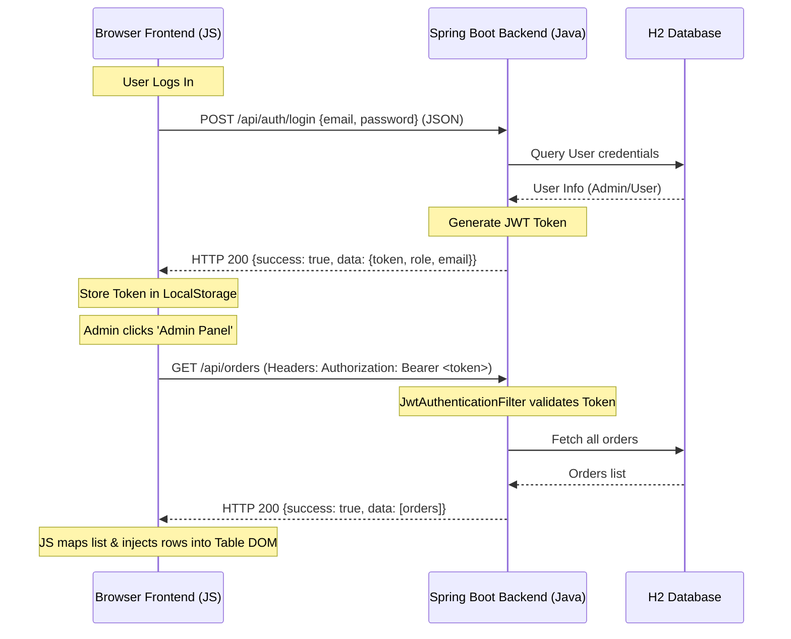

# 🧠 FoodExpress — Code Logic & Architecture

This document explains the architecture, endpoint flow, and code logic of the features implemented in the FoodExpress Spring Boot application.

---

## 1. 🏗️ High-Level Architecture

FoodExpress is built as a **Single-Page-style Web Application** with:
- **Backend**: A Java Spring Boot REST API backed by an in-memory SQL database (H2) and Spring Data JPA.
- **Security**: Stateless JWT-based authentication using Spring Security filters.
- **Frontend**: Lightweight static HTML5, CSS3 variables, and vanilla asynchronous JavaScript (`fetch` API).

---

## 2. 🗄️ Database Seeding (`DatabaseSeeder.java`)

To ensure the database is ready for testing immediately upon startup, the backend runs a startup seeder class:
- **Safe Seeding**:
  - The seeder checks `userRepository.findByEmail("dev@example.com").isEmpty()`. If the admin user is missing, it creates the profile. It does **not** run `deleteAll()`, protecting custom user data.
  - The seeder checks `foodRepository.count() == 0`. It seeds default menu items only if the table is empty, preserving custom food items added by the admin.
- **Food Images**: All items are mapped to verified, high-quality local images saved in `src/main/resources/static/images/` (e.g., clay-pot biryani, green spinach-based Hyderabadi paneer, skewered Paneer Tikka).

---

## 3. 🛡️ JWT Authentication & Validation (`AuthController.java`)

Authentication is handled statelessly via JSON Web Tokens:
- **Registration (`/api/auth/signup`)**:
  - Validates that all fields are present, passwords are at least 6 characters, and the email is not already registered.
  - **Email Domain Validation**: Enforces that all user email addresses must end with `@gmail.com`. The only exception is the pre-configured developer profile `dev@example.com`.
- **Login (`/api/auth/login`)**:
  - Authenticates credentials against H2 DB hashes using `BCryptPasswordEncoder`.
  - Generates a JWT token using `JwtTokenProvider` containing the user's ID, signing it.
  - Returns the JWT token, name, email, phone, and **user role** (e.g., `ADMIN`) in the JSON response payload.

---

## 4. 🪟 Frontend Glassmorphic Auth Modal (`script.js` & `style.css`)

Instead of redirecting users to separate blank login/signup pages, auth is handled in a single modern popup modal:
- **DOM Structure**: A modal overlay (`#auth-modal`) containing tabs (`#tab-login` and `#tab-signup`) is embedded in `index.html` and `menu.html`.
- **Tab Switching**: Clicking a tab toggles classes and displays either `#login-form` or `#signup-form` in the modal dynamically.
- **Form Interception**: JavaScript hooks `addEventListener("submit")` on both forms, reads values (bound by `name` attributes like `name="phone"`), performs validation, sends AJAX calls to `/api/auth`, and closes the modal on success without page reloads.
- **Header Updates (`updateHeader()`)**: Reads the token and user payload from `localStorage`. If `user.role === 'ADMIN'`, the **Admin Panel** link is displayed in the navigation header.

---

## 5. 👑 Admin Dashboard & REST APIs (`FoodController.java` & `OrderController.java`)

We ported all legacy Express admin features to the Java backend and secured them at the API layer:

### Spring Security Restrictions (`SecurityConfig.java`)
We restricted all modifying and administrative requests to the `ADMIN` role:
```java
.requestMatchers(HttpMethod.POST, "/api/foods/add").hasRole("ADMIN")
.requestMatchers(HttpMethod.DELETE, "/api/foods/**").hasRole("ADMIN")
.requestMatchers(HttpMethod.PATCH, "/api/foods/**").hasRole("ADMIN")
.requestMatchers(HttpMethod.GET, "/api/orders").hasRole("ADMIN")
.requestMatchers(HttpMethod.PATCH, "/api/orders/**").hasRole("ADMIN")
```

### Backend Controllers
1. **Stats**: Loaded by calling `GET /api/foods` and `GET /api/orders` simultaneously. Total revenue is calculated dynamically on the frontend by summing up the order totals.
2. **Food Management**:
   - `POST /api/foods/add` adds a new food item.
   - `DELETE /api/foods/{id}` deletes a food item.
   - `PATCH /api/foods/{id}/price` updates a food item's price in-place.
3. **Order Management**:
   - `GET /api/orders` (mapped as root GET) returns all customer orders across the system.
   - `PATCH /api/orders/{id}/status` updates the order's status.

### Frontend Admin Modal (`#admin-modal`)
Clicking **Admin Panel** opens a modal with three tabs:
- **Dashboard Stats**: Shows cards indicating total foods, orders, and calculated revenue.
- **Manage Menu**: A table displaying food items. Includes:
  - An inline price edit button that toggles a price input, sending a `PATCH /api/foods/{id}/price` on save.
  - A trash icon button sending a `DELETE /api/foods/{id}` request.
  - An "Add Food Item" form to expand the menu.
- **Manage Orders**: Displays a table of all orders with dropdown selectors. Toggling a dropdown choice sends a `PATCH /api/orders/{id}/status` request to update status.

---

## 6. 🔗 Frontend-Backend Communication Flow

The frontend and backend interact as an asynchronous client-server architecture:



### 1. Request Dispatch (Fetch API)
All requests from the frontend to the backend are triggered asynchronously using the browser's native `fetch` API.
Example of fetching user order details:
```javascript
const res = await fetch("/api/orders/my-orders", { 
    headers: { "Authorization": `Bearer ${token}` } 
});
const data = await res.json();
```

### 2. Serialization & Serialization Content-Type
- **Request Payloads**: The frontend serializes JavaScript objects to JSON strings using `JSON.stringify(payload)` and sets the `"Content-Type": "application/json"` header on `POST` / `PATCH` requests.
- **Response Payloads**: The Spring Boot REST controllers automatically serialize returned Java maps/entities into JSON strings (using Jackson) and serve them with `Content-Type: application/json`.

### 3. State Management & Authentication Headers
- **Token Storage**: Upon successful login or signup, the backend returns a signed JWT token. The frontend stores this locally using `localStorage.setItem("token", token)`.
- **Token Propagation**: For any protected endpoint (like placing orders, listing all orders, updating menu prices, or deleting items), the frontend reads the stored token and injects it into the HTTP headers:
  `"Authorization": "Bearer " + token`
- **Backend Filter Validation**: The `JwtAuthenticationFilter` intercepts all incoming requests, parses the `Authorization` header, extracts the token, verifies the signature, and populates the Spring Security Context so that controllers can query the authenticated user using `SecurityContextHolder.getContext().getAuthentication()`.

